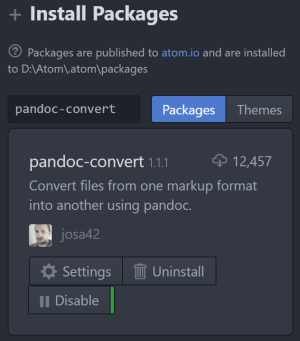

# Markdown-Learning
Markdown is a mark language and is useful in writing blogs or documents. This repository show markdown ide and grammar to learn and use it quickly.
# Getting started
- [Markdown IDE](#markdown-ide)
- [Markdown Grammar](#markdown-grammar)
- [Export Markdown](#export_markdown)
# Markdown IDE
Build the best developing environment of markdown in just two steps!
1. [Install atom](#install-atom)
2. [Install plugins](#install-plugins)
## Install atom
download install package from https://atom.io/
> suggest to download from https://github.com/atom/atom/tags so that you can decide the setup location

then install happily
## Install plugins
press `ctrl+,` to open the settings tab

search and install following packages  
`language-markdown`  
`markdown-writer`  
`markdown-preview-enhanced`

Well, enjoy writing markdown code with a preview window!

# Markdown Grammar
## index
> [title](#title)  
> [blockquote](#blockquote)  
> [font style](#font-style)  
> [code](#code)  
> [list](#list)  
> [split line](#split-line)  
> [link](#link)  
> [image](#image)  
> [tag](#tag)  
> [table](#table)  
<!-- title -->
## title
```markdown
# title1
## title2
### title3
#### title4
##### title5
###### title6
```
# title1
## title2
### title3
#### title4
##### title5
###### title6
<!-- blockquote -->
## blockquote
```markdown
> blockquote1
>> blockquote2
>>> blockquote3
```
> blockquote1
>> blockquote2
>>> blockquote3
<!-- code -->
## code
#### use ```
    ```[c|java|html|python...]
        <!-- code -->
    ```
such as java code

```java
public static void main(String[] args) {
    System.out.println("java code");
}
```
#### use indent
you can use tab of four whitespace before every line of code
```markdown
    int main() {
        println("c code")
    }
```
result
```c
int main() {
    println("c code")
}
```
<!-- font style -->
## font style
```markdown
*italic font* 
**bold font**
~~delete font~~
```
*italic font*  
**bold font**  
~~delete font~~
<!-- list -->
## list
#### unordered list
```Markdown
- first
- second
- third
```
- first
- second
- third
#### ordered list
```markdown
1. first
2. second
3. third
```
1. first
2. second
3. third
<!-- split line -->
## split line
```markdown
---
```
---
<!-- link -->
## link
#### anchor
```markdown
[back to top ↑](#markdown-grammar)
```
[back to top ↑](#markdown-grammar)
> ! link target must be lowercase and contains no whitespace
#### external
```markdown
[personal blog](http://www.liyupi.top)
```
[personal blog](http://www.liyupi.top)
<!-- image -->
## image
#### relative path
```markdown

```

#### absolute path
```markdown

```

<!-- tag -->
## tag
```markdown
`ctrl+a` `ctrl+d`
```
`ctrl+a` `ctrl+d`
<!-- table -->
## table
#### align
left `|:---|`
right `|---:|`
center  `|:--:|`  
```markdown
| name  | age | sex | salary |
|-------|:---:|-----|-------:|
| wang  | 30  | m   | $1,000 |
| ming  | 20  | f   | $2,000 |
| candy | 10  | f   | $0     |
```
| name  | age | sex | salary |
|-------|:---:|-----|-------:|
| wang  | 30  | m   | $1,000 |
| ming  | 20  | f   | $2,000 |
| candy | 10  | f   | $0     |

# Export Markdown
Well, you can export your markdown file (like .md) to other file format (like .docx, .pdf, .html) easily by using an atom plugin called [pandoc-convert](https://github.com/josa42/atom-pandoc-convert).



Use hotkey `ctrl+shift+p` and search "pandoc convert" to generate a target file.
<!-- back to top -->
[back to top ↑](#markdown-learning)
